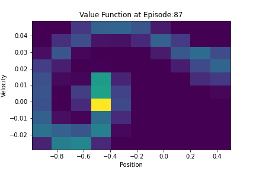

# DQN & Dueling DQN Agents for 'MountainCar-v0'

- Tensorflow based [DQN](DQN-TensorFlow2) Agent for 'MountainCar-v0' openai gym environment.
- PyTorch based [DDQN](DDQN-PyTorch) Agent for 'MountainCar-v0' openai gym environment.

## Agent Training & Testing Profile

 1. DQN Agent

    |Episode Length|Reward Plot|Value Plot|
    |:--:|:--:|:--:|
    |<p ></p>|<p ></p>|<p ></p>|

 2. DDQN Agent

    <p ></p>

## Dependencies

Install dependencies using:

```bash
pip install -r requirements.txt 
```

## TODO

- Profile DQN similar to DDQN. The laptop I use breaks while installing TF2 :(

## Contact

- Email: navalekanishk@gmail.com
- Website: <https://kanishknavale.github.io/>
